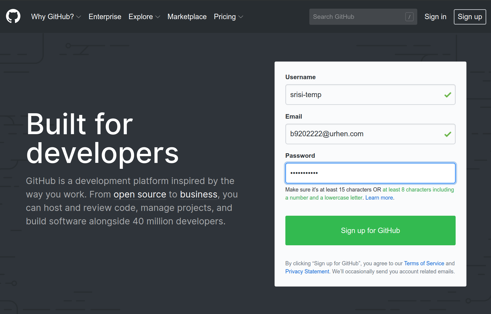
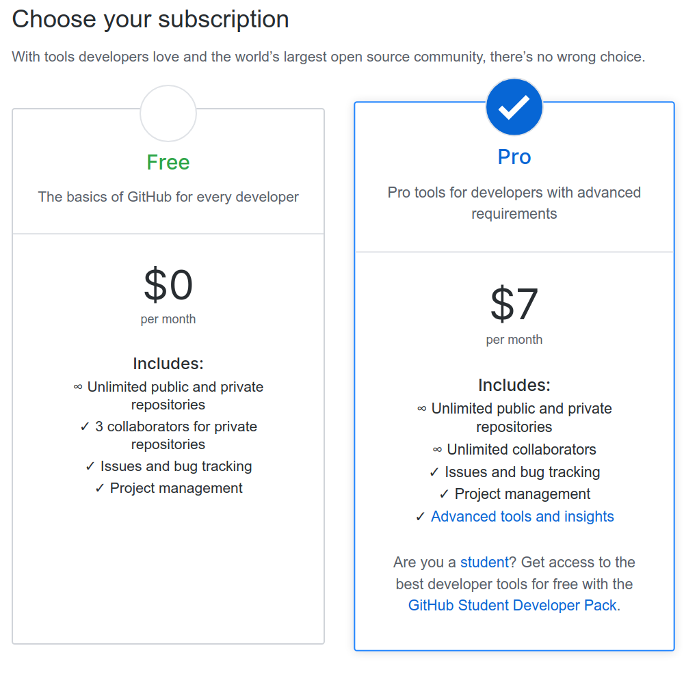
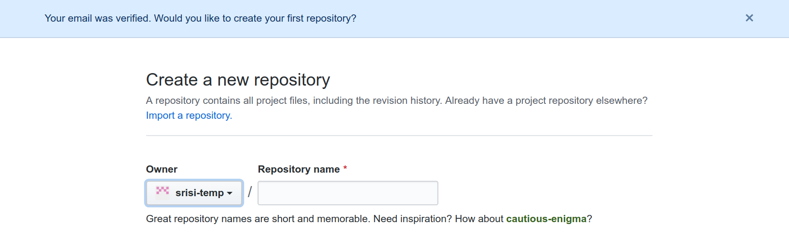
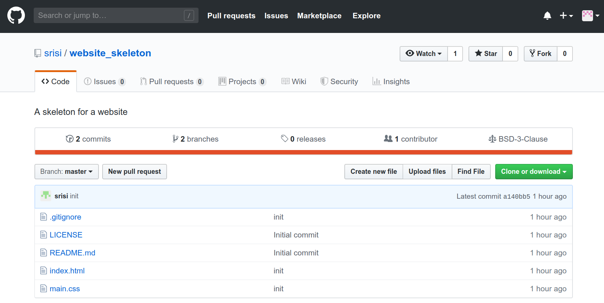
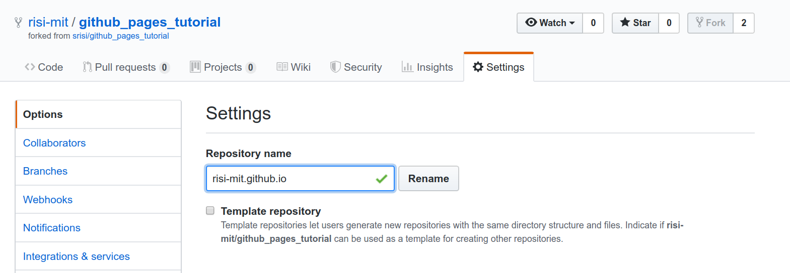

# Setup

Welcome!

To get started, you will need a [Github](www.github.com) account. If you don't already have one, go to [www.github.com](www.github.com) and create one.

If you're a student, you can sign up for the  [student developer pack](https://education.github.com/pack), 
which gives you access to a lot of different tools. The free account is also perfectly fine, though.

Once your account is set up, Github will ask you if want to create your first repository. 
"Repository" is Github's name for a place where you can keep all of the files for one project 
or one website. However, we're not going to create a new repository right now, so you can close 
the  dialog box.

Instead of creating a new repository, we are going to copy the existing tutorial. To do this, go to
the [Github website for this tutorial](https://github.com/srisi/github_pages_tutorial/) and click
 on the "Fork" button in the top right corner.
 
 Forking means that you're creating your own copy of the github_pages_tutorial repository, which 
 you can now edit on your own.

Once the repository is copied, we just have one step left. We need to rename it. To do this, click
on Settings.

By default, Github assumes that a repository just contains code. To make your new website visible
 to everyone, we need to follow Github's naming scheme. 
 
 Specifically, you need to rename your repository to `<username>.github.io`. In my case, it is 
 risi-temp.github.io .
 
 Voila, once this change is applied, your website is ready! It is an exact copy of this tutorial 
 website ready for you to modify. Go to `<username>.github.io` to check it out.
 
 